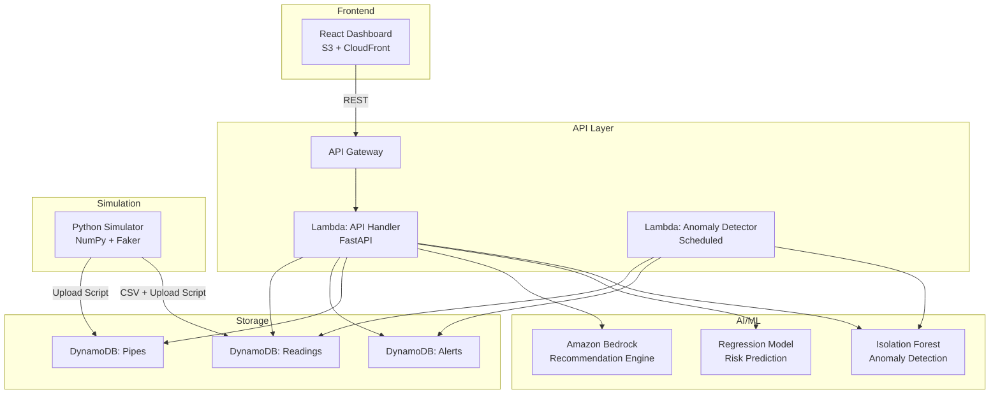
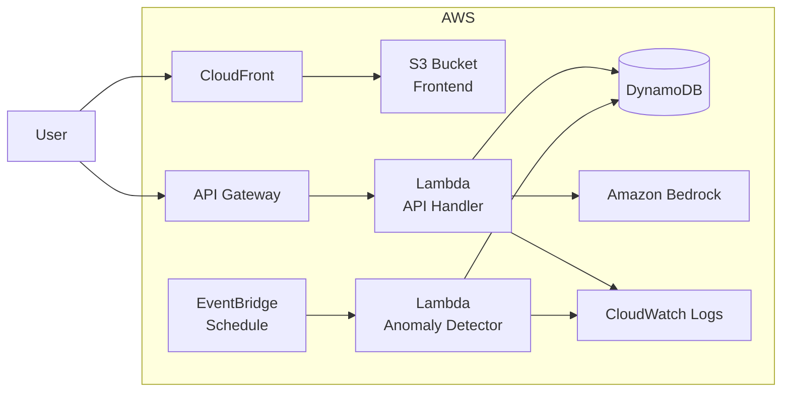

# Design Document: AquaMind AI

## Overview

AquaMind AI is an AI-powered digital twin platform for smart water infrastructure. It simulates urban water networks, detects anomalies in sensor data, predicts infrastructure failures, and generates cost-optimized repair recommendations via a generative AI layer.

The system is composed of four major subsystems:
- **Simulation Engine** — generates realistic time-series sensor data with injected anomalies
- **ML Backend** — anomaly detection (Isolation Forest), risk prediction (regression), and priority scoring
- **Recommendation Engine** — Amazon Bedrock-backed natural language repair recommendations
- **React Dashboard** — interactive frontend for alerts, simulations, and AI recommendations

All backend logic runs as AWS Lambda functions behind API Gateway, with DynamoDB for persistence and S3/CloudFront for frontend hosting.

---

## Architecture



### Request Flow

1. Simulation script generates 90-day time-series data and uploads to DynamoDB
2. Scheduled Lambda runs Anomaly Detector against new Readings, writes Alerts
3. Dashboard fetches Alerts via API Gateway → Lambda
4. Engineer selects Alert → Dashboard calls `/whatif` for Impact Simulation
5. Dashboard calls `/explain` → Lambda invokes Bedrock → returns recommendation

---

## Components and Interfaces

### 1. Simulation Engine (`simulator/`)

Standalone Python script (not deployed to Lambda). Generates synthetic data and uploads to DynamoDB.

**Responsibilities:**
- Generate 200 pipes, 100 junctions with EPANET-like topology
- Produce 90-day hourly time-series: flow (m³/h), pressure (psi)
- Inject ≥10 anomalies: leak (pressure drop + flow spike), gradual degradation, random noise
- Attach metadata: population affected per pipe, repair cost estimate
- Output: CSV files + DynamoDB upload script

**Key functions:**
```python
def generate_network(num_pipes=200, num_junctions=100) -> Network
def generate_readings(network, days=90, interval_hours=1) -> List[Reading]
def inject_anomalies(readings, min_count=10) -> List[Reading]
def upload_to_dynamodb(readings, pipes, table_prefix) -> None
```

### 2. API Handler Lambda (`backend/app/`)

FastAPI application packaged for Lambda via Mangum adapter.

**Endpoints:**

| Method | Path | Description |
|--------|------|-------------|
| POST | `/simulate` | Trigger simulation run |
| GET | `/pipes` | List all pipes with metadata |
| GET | `/alerts` | List alerts (paginated, sorted by priority desc) |
| POST | `/detect` | Run anomaly detection on submitted sensor data |
| POST | `/whatif` | Run impact simulation for an alert |
| POST | `/explain` | Generate AI recommendation via Bedrock |

**Response envelope (all endpoints):**
```json
{
  "status": "success" | "error",
  "data": { ... },
  "error_message": "string (only on error)"
}
```

### 3. Anomaly Detector Lambda (`backend/detector/`)

Scheduled Lambda (EventBridge, e.g. every 5 minutes). Pulls unprocessed Readings from DynamoDB, runs Isolation Forest, writes Alerts.

**Interface:**
```python
def handler(event, context):
    readings = fetch_unprocessed_readings()
    scores = model.predict(readings)  # anomaly_score 0–1
    alerts = [create_alert(r, s) for r, s in zip(readings, scores) if s > THRESHOLD]
    write_alerts(alerts)
```

### 4. ML Models (`backend/models/`)

**Anomaly Detection — Isolation Forest:**
- Input features: `flow_rate`, `pressure`
- Output: `anomaly_score` ∈ [0, 1]
- Trained offline on simulation data, serialized as `isolation_forest.pkl`
- Loaded at Lambda cold start; 503 returned if file missing

**Risk Predictor — Linear Regression:**
- Input features: `alert_frequency_7d`, `anomaly_severity_avg`, `pipe_age_years`
- Output: `failure_probability` ∈ [0.0, 1.0]
- Predicts failure probability over next 7 days

**Priority Scorer:**
- Formula: `priority_score = (anomaly_score × 0.5) + (population_factor × 0.3) + (repair_cost_factor × 0.2)`
- Normalized to [0, 1], then mapped to 1–100 integer scale
- Priority levels: Critical ≥ 75, High 50–74, Medium 25–49, Low < 25

### 5. Impact Simulator (`backend/app/simulator.py`)

Pure computation module (no external calls).

**Input:**
```json
{
  "alert_id": "string",
  "leak_rate": "float (m³/h)",
  "population_affected": "int",
  "repair_cost": "float (USD)",
  "time_horizon_days": "int (1–365, default 30)"
}
```

**Output:**
```json
{
  "ignore_scenario": {
    "total_water_loss_liters": "float",
    "financial_cost_usd": "float",
    "infrastructure_damage_score": "float"
  },
  "repair_scenario": {
    "repair_cost_usd": "float",
    "water_loss_prevented_liters": "float"
  },
  "savings_usd": "float",
  "recommended_action": "string"
}
```

### 6. Recommendation Engine (`backend/app/recommender.py`)

Wraps Amazon Bedrock (Claude model).

**Prompt template:**
```
Given a leak in pipe {pipe_id}, loss rate {loss_rate} m³/h,
population affected {population}, and repair cost ${repair_cost},
calculate the impact of ignoring vs repairing over {horizon} days.
Return a recommendation with estimated savings and urgency rationale.
```

**Fallback:** If Bedrock returns an error, construct recommendation from Simulation_Result fields without LLM.

### 7. React Dashboard (`frontend/src/`)

**Components:**

| Component | Responsibility |
|-----------|---------------|
| `MapView` | Color-coded pipe network map (risk level → color), click for details |
| `AlertsPanel` | Sorted alert list with priority badges, select to drill down |
| `ImpactSimulator` | "Analyze Impact" button, side-by-side ignore/repair comparison |
| `RecommendationPanel` | Renders AI recommendation text |
| `SensorGraph` | Flow & pressure trend charts for selected node |

**Data flow:**
- Polls `GET /alerts` every 30 seconds (configurable via env var)
- API base URL from `REACT_APP_API_URL` environment variable
- On alert select: fetches node sensor history
- On "Analyze Impact": calls `POST /whatif`, then `POST /explain`

---

## Data Models

### DynamoDB Table: `Pipes`

| Attribute | Type | Notes |
|-----------|------|-------|
| `pipe_id` (PK) | String | e.g. `pipe_001` |
| `junction_start` | String | |
| `junction_end` | String | |
| `length_m` | Number | |
| `diameter_mm` | Number | |
| `age_years` | Number | |
| `population_affected` | Number | |
| `repair_cost_usd` | Number | Estimated base cost |
| `material` | String | e.g. `PVC`, `cast_iron` |

### DynamoDB Table: `Readings`

| Attribute | Type | Notes |
|-----------|------|-------|
| `pipe_id` (PK) | String | |
| `timestamp` (SK) | String | ISO 8601 |
| `flow_rate` | Number | m³/h |
| `pressure` | Number | psi |
| `anomaly_label` | String | `normal`, `leak`, `degradation`, `noise` |
| `processed` | Boolean | False until Detector runs |
| `ttl` | Number | Unix epoch, configurable TTL |

**GSI:** `processed-timestamp-index` on `processed` + `timestamp` for efficient unprocessed reads.

### DynamoDB Table: `Alerts`

| Attribute | Type | Notes |
|-----------|------|-------|
| `alert_id` (PK) | String | UUID |
| `pipe_id` | String | |
| `timestamp` | String | ISO 8601 |
| `anomaly_type` | String | `leak`, `degradation`, `noise` |
| `anomaly_score` | Number | 0.0–1.0 |
| `failure_probability` | Number | 0.0–1.0 |
| `priority_score` | Number | 1–100 |
| `priority_level` | String | `Critical`, `High`, `Medium`, `Low` |
| `immediate_action_required` | Boolean | True if Critical |
| `flow_rate` | Number | Raw reading |
| `pressure` | Number | Raw reading |
| `ttl` | Number | Unix epoch |

**GSI:** `pipe-timestamp-index` on `pipe_id` + `timestamp` for historical queries.

### DynamoDB Table: `SimulationResults`

| Attribute | Type | Notes |
|-----------|------|-------|
| `simulation_id` (PK) | String | UUID |
| `alert_id` | String | FK to Alerts |
| `timestamp` | String | ISO 8601 |
| `time_horizon_days` | Number | |
| `ignore_water_loss_liters` | Number | |
| `ignore_financial_cost_usd` | Number | |
| `ignore_damage_score` | Number | |
| `repair_cost_usd` | Number | |
| `water_loss_prevented_liters` | Number | |
| `savings_usd` | Number | |
| `recommended_action` | String | |
| `ai_recommendation` | String | Bedrock output or fallback |
| `ttl` | Number | Unix epoch |

---

## AWS Infrastructure



**SAM template resources:**
- `ApiHandlerFunction`: Python 3.11, 512MB, 29s timeout, API Gateway trigger
- `AnomalyDetectorFunction`: Python 3.11, 256MB, 300s timeout, EventBridge schedule
- `PipesTable`, `ReadingsTable`, `AlertsTable`, `SimulationResultsTable`: DynamoDB on-demand
- `ReadingsProcessedIndex`: GSI on Readings table
- `AlertsPipeIndex`: GSI on Alerts table

---

## Correctness Properties

*A property is a characteristic or behavior that should hold true across all valid executions of a system — essentially, a formal statement about what the system should do. Properties serve as the bridge between human-readable specifications and machine-verifiable correctness guarantees.*

### Property 1: Simulation produces readings for all nodes

*For any* valid simulation configuration, the generated dataset must contain flow rate and pressure readings for every configured network node, with no node producing fewer readings than the configured interval count.

**Validates: Requirements 1.1**

---

### Property 2: Anomaly injection produces labeled anomalies

*For any* simulation configuration with `anomaly_rate > 0`, the resulting Sensor_Data must contain at least one record with a non-`normal` anomaly label.

**Validates: Requirements 1.2**

---

### Property 3: Sensor data round-trip schema integrity

*For any* generated Reading, writing it to DynamoDB and reading it back must return a record containing all required fields: `pipe_id`, `timestamp`, `flow_rate`, `pressure`, and `anomaly_label`.

**Validates: Requirements 1.3**

---

### Property 4: Invalid simulation config returns field-level errors

*For any* simulation configuration missing one or more required parameters, the API must return a 422 response whose error body identifies each missing field by name.

**Validates: Requirements 1.4, 8.3**

---

### Property 5: Every reading receives a classification

*For any* batch of Sensor_Data records submitted to the Anomaly Detector, the number of classification outputs must equal the number of input records — no reading is skipped.

**Validates: Requirements 2.1**

---

### Property 6: Anomalous readings produce complete Alert records

*For any* reading classified as anomalous, the resulting Alert record must contain `pipe_id`, `timestamp`, `anomaly_type`, `flow_rate`, and `pressure`.

**Validates: Requirements 2.2**

---

### Property 7: Failure probability is always in range

*For any* Alert passed to the Risk Predictor, the returned `failure_probability` must be a number in the closed interval [0.0, 1.0].

**Validates: Requirements 3.1**

---

### Property 8: Priority level thresholds are correctly applied

*For any* `failure_probability` value `p`, the assigned priority level must satisfy: Critical if `p ≥ 0.75`, High if `0.50 ≤ p < 0.75`, Medium if `0.25 ≤ p < 0.50`, Low if `p < 0.25`.

**Validates: Requirements 3.3**

---

### Property 9: Incomplete features still yield prediction with warning

*For any* node input with one or more missing features, the Risk Predictor response must contain both a `failure_probability` value and a non-empty `data_quality_warning` field.

**Validates: Requirements 3.5**

---

### Property 10: Priority score is always in valid range

*For any* Alert, the computed `priority_score` must be an integer in the closed interval [1, 100].

**Validates: Requirements 4.1**

---

### Property 11: Alerts API returns results sorted by priority descending

*For any* collection of Alerts in the system, the `GET /alerts` response must return them in descending order of `priority_score` — no alert with a lower score appears before one with a higher score.

**Validates: Requirements 4.2**

---

### Property 12: Critical alerts carry the immediate action flag

*For any* Alert with `priority_level = "Critical"`, the API response payload must include `immediate_action_required: true`.

**Validates: Requirements 4.3**

---

### Property 13: Impact simulation result completeness

*For any* valid simulation request, the Simulation_Result must contain both an `ignore_scenario` and a `repair_scenario`, each including `water_loss_liters`, `financial_cost_usd`, and `infrastructure_damage_score`, all with non-negative values.

**Validates: Requirements 5.1, 5.2**

---

### Property 14: Time horizon boundary enforcement

*For any* `time_horizon_days` value outside [1, 365], the `/whatif` endpoint must return a 400 error. For any value inside [1, 365], the endpoint must return a valid Simulation_Result.

**Validates: Requirements 5.5**

---

### Property 15: Recommendation response always contains required fields

*For any* recommendation response — whether generated by Bedrock or via fallback — the response must contain `recommended_action`, `savings_usd`, `repair_cost_usd`, and a non-empty urgency rationale.

**Validates: Requirements 6.1, 6.5**

---

### Property 16: Bedrock prompt contains all required context

*For any* recommendation request, the prompt constructed and sent to Bedrock must contain the `pipe_id`, `loss_rate`, `population_affected`, `repair_cost`, and `time_horizon` values from the request.

**Validates: Requirements 6.2**

---

### Property 17: API response envelope is always present

*For any* API call to any endpoint, regardless of success or error, the JSON response must contain a `status` field with value `"success"` or `"error"`, and either a `data` field (on success) or an `error_message` field (on error).

**Validates: Requirements 8.2**

---

### Property 18: Structured log output contains required fields

*For any* API request processed by the Lambda handler, the emitted CloudWatch log entry must contain `timestamp`, `request_id`, `endpoint`, and `response_status_code`.

**Validates: Requirements 8.6**

---

### Property 19: Persisted records always include TTL

*For any* Sensor_Data, Alert, or Simulation_Result written to DynamoDB, the stored record must contain a `ttl` attribute with a valid Unix epoch value.

**Validates: Requirements 9.1**

---

### Property 20: Historical alert query returns results sorted by timestamp descending

*For any* node with multiple Alerts, querying historical alerts for that node must return them in descending order of `timestamp`.

**Validates: Requirements 9.2**

---

### Property 21: Pagination enforces maximum page size

*For any* Alert or Sensor_Data query that would return more than 100 records, the response must contain exactly 100 records and a non-null `continuation_token`. Applying the continuation token must return the next page.

**Validates: Requirements 9.3**

---

### Property 22: Dashboard preserves state on API error

*For any* API error response received by the Dashboard, the previously displayed alert list must remain visible and an error message must be shown — the component must not unmount or reset to empty state.

**Validates: Requirements 7.5**

---

## Error Handling

### Lambda / API Layer

| Condition | Behavior |
|-----------|----------|
| Missing ML model file at startup | Log error, return 503 on all `/detect` requests |
| Invalid request payload | Return 422 with field-level validation errors (FastAPI/Pydantic) |
| Alert ID not found | Return 404 with descriptive message |
| `time_horizon_days` out of range | Return 400 with range description |
| DynamoDB write failure | Retry up to 3× with exponential backoff (100ms, 200ms, 400ms); return 500 after exhaustion |
| Bedrock service error | Return fallback recommendation built from Simulation_Result; log error |
| Lambda timeout (>29s) | API Gateway returns 504 to caller |
| Unhandled exception | Return 500 with `request_id` for tracing; log full stack trace to CloudWatch |

### Frontend

| Condition | Behavior |
|-----------|----------|
| `GET /alerts` fails | Show inline error banner; preserve last-known alert list |
| `POST /whatif` fails | Show error in Impact Simulator panel; keep alert detail visible |
| `POST /explain` fails | Show "Recommendation unavailable" message; display simulation data |
| Network timeout | Treat as API error; apply same error display rules |

### Simulation Engine

| Condition | Behavior |
|-----------|----------|
| Missing config parameters | Raise `ValueError` with field names; exit with non-zero code |
| DynamoDB upload failure | Log error per record; continue uploading remaining records; report summary |

---

## Testing Strategy

### Dual Testing Approach

Both unit tests and property-based tests are required. They are complementary:
- **Unit tests** verify specific examples, integration points, and error conditions
- **Property tests** verify universal invariants across randomized inputs

### Property-Based Testing

**Library:** `hypothesis` (Python) for backend; `fast-check` (TypeScript) for frontend components.

Each property test must run a minimum of **100 iterations**.

Every property test must include a comment tag in the format:
```
# Feature: aquamind-ai, Property N: <property_text>
```

Each correctness property listed above must be implemented by exactly one property-based test.

**Example property test (Python/Hypothesis):**
```python
from hypothesis import given, settings
from hypothesis import strategies as st

# Feature: aquamind-ai, Property 10: Priority score is always in valid range
@given(
    anomaly_score=st.floats(min_value=0.0, max_value=1.0),
    population_factor=st.floats(min_value=0.0, max_value=1.0),
    repair_cost_factor=st.floats(min_value=0.0, max_value=1.0),
)
@settings(max_examples=100)
def test_priority_score_in_range(anomaly_score, population_factor, repair_cost_factor):
    score = compute_priority_score(anomaly_score, population_factor, repair_cost_factor)
    assert 1 <= score <= 100
```

### Unit Tests

Unit tests should cover:
- Specific examples demonstrating correct behavior (e.g., known anomaly inputs produce expected scores)
- Integration points between components (e.g., detector writes alert, scorer reads it)
- All error conditions (503 on missing model, 404 on missing alert, 400 on bad time horizon, 422 on invalid payload)
- Bedrock fallback path
- DynamoDB retry logic (mock 3 failures, verify retry count and final 500)
- End-to-end demo flow (integration test)
- Model precision/recall benchmark on labeled simulation dataset (≥0.80 each)

Avoid writing unit tests that duplicate what property tests already cover (e.g., don't write 50 unit tests for priority score ranges when a property test handles all of them).

### Test Organization

```
tests/
  unit/
    test_anomaly_detector.py
    test_risk_predictor.py
    test_priority_scorer.py
    test_impact_simulator.py
    test_recommender.py
    test_api_endpoints.py
    test_dynamodb_retry.py
  property/
    test_props_simulation.py       # Properties 1–4
    test_props_detection.py        # Properties 5–6
    test_props_risk_priority.py    # Properties 7–12
    test_props_simulation_api.py   # Properties 13–14
    test_props_recommendation.py   # Properties 15–16
    test_props_api.py              # Properties 17–18
    test_props_persistence.py      # Properties 19–21
  frontend/
    AlertsPanel.test.tsx           # Property 22, examples 7.2–7.4
```
